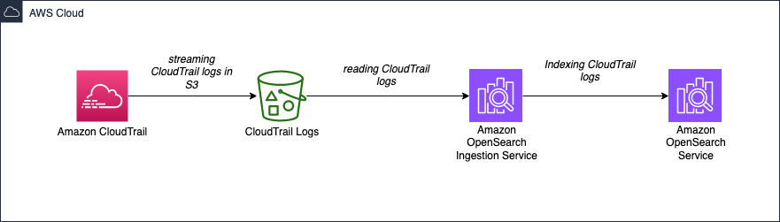

# AWS CloudTrail to S3 to OpenSearch Ingestion Service to Amazon OpenSearch Service

This AWS CDK project aims to provision a comprehensive infrastructure environment by leveraging various AWS services like [Amazon CloudTrail](https://www.amazonaws.cn/en/cloudtrail/), [Amazon S3](https://aws.amazon.com/s3/), [Amazon OpenSearch Ingestion (OSI)](https://docs.aws.amazon.com/opensearch-service/latest/developerguide/ingestion.html), and [Amazon OpenSearch Service (AOS)](https://aws.amazon.com/opensearch-service/). CloudTrail enables the logging and tracking of API activities, while S3 acts as the storage repository. OSI plays a crucial role by reading the CloudTrail logs stored in S3 and indexing them into AOS for efficient searching and analysis. By automating the provisioning process using CDK, this project ensures a streamlined and scalable infrastructure setup, empowering organizations to effectively monitor and analyze their AWS resources.



The `cdk.json` file tells the CDK Toolkit how to execute your app.

This project is set up like a standard Python project.  The initialization
process also creates a virtualenv within this project, stored under the `.venv`
directory.  To create the virtualenv it assumes that there is a `python3`
(or `python` for Windows) executable in your path with access to the `venv`
package. If for any reason the automatic creation of the virtualenv fails,
you can create the virtualenv manually.

To manually create a virtualenv on MacOS and Linux:

```
$ python3 -m venv .venv
```

After the init process completes and the virtualenv is created, you can use the following
step to activate your virtualenv.

```
$ source .venv/bin/activate
```

If you are a Windows platform, you would activate the virtualenv like this:

```
% .venv\Scripts\activate.bat
```

Once the virtualenv is activated, you can install the required dependencies.

```
$ pip install -r requirements.txt
```

At this point you can now synthesize the CloudFormation template for this code.

```
$ cdk synth
```


### CDK Deploy

You use `cdk deploy` actually to create the resources.

```
$ cdk deploy
```

### CDK Destroy

You use `cdk destroy` to remove the resources you created with `cdk deploy`.

```
$ cdk destroy
```

⚠️ You must delete the below resources manually.

1. `CloudWatch Log groups`
2. `s3 buckets`


## References

- [OpenSearch Service Boto3 API documentations](https://boto3.amazonaws.com/v1/documentation/api/latest/reference/services/opensearch.html)
- [Using the AWS SDKs to interact with Amazon OpenSearch Ingestion](https://docs.aws.amazon.com/opensearch-service/latest/developerguide/osis-sdk.html)
- [AmazonOpenSearchIngestionFullAccess Policy](https://docs.aws.amazon.com/aws-managed-policy/latest/reference/AmazonOpenSearchIngestionFullAccess.html)
